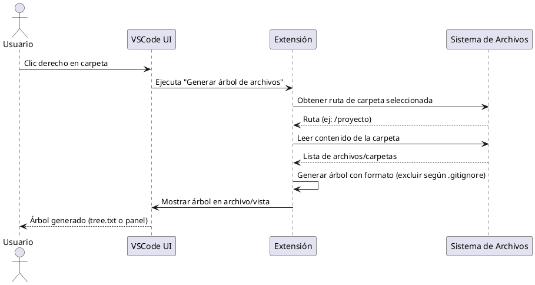
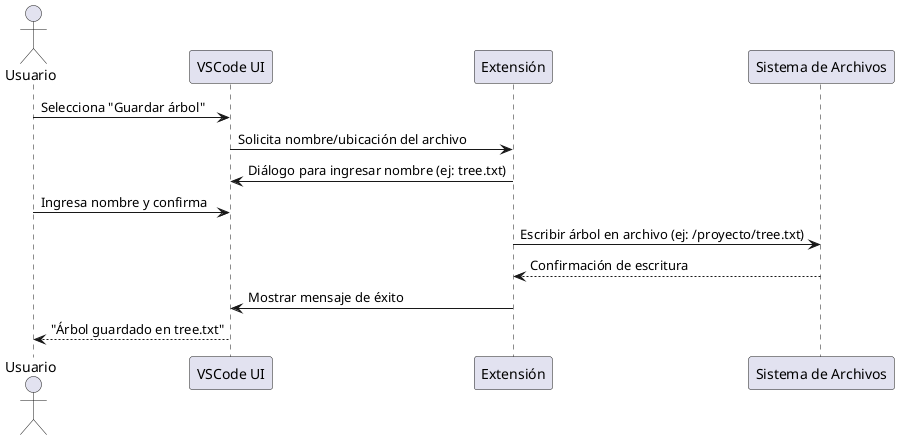
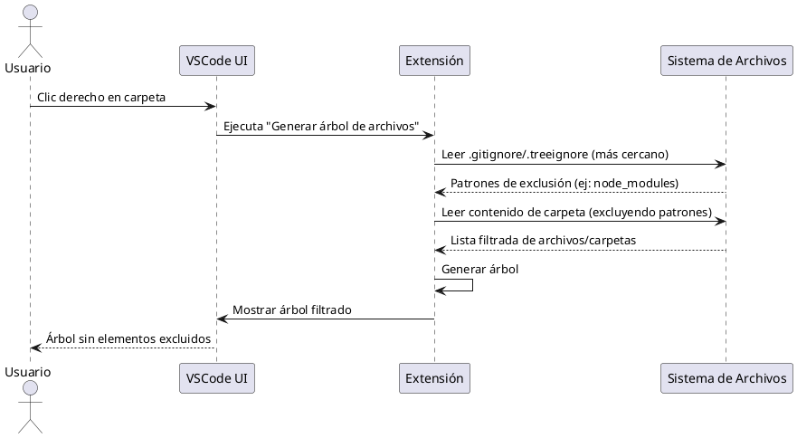
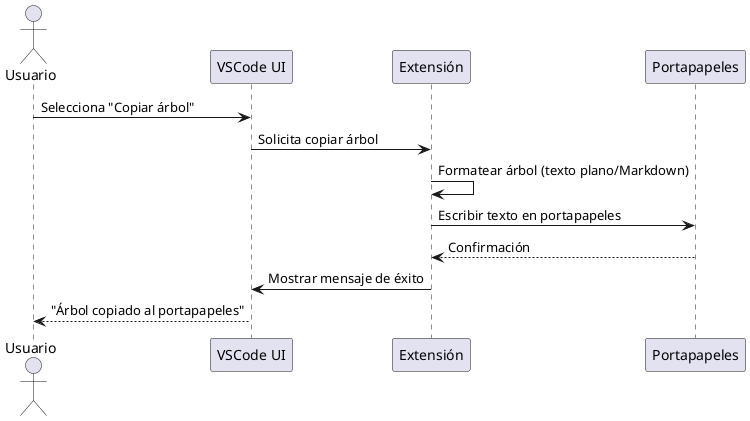
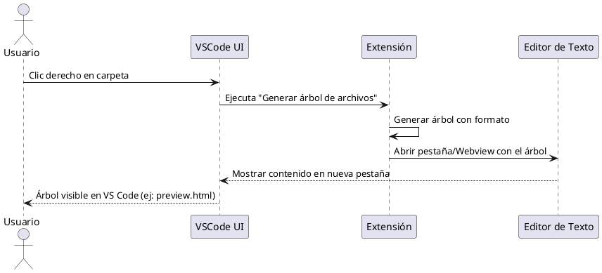

Aquí tienes los diagramas de secuencia en formato PlantUML para cada caso de uso. 
---

### **Caso de uso 1: Generar el árbol de archivos**

---

### **Caso de uso 2: Guardar el árbol en un archivo**

---

### **Caso de uso 3: Excluir archivos/carpetas**

---

### **Caso de uso 4: Copiar al portapapeles**

---

### **Caso de uso 5: Mostrar en vista de VS Code**

